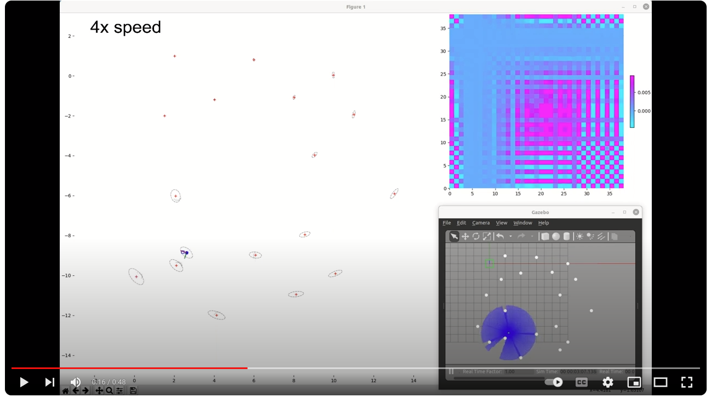

# SLAM Extended Kalman Filter

This project aims to implement from scratch the vanila EKF SLAM algorithm in a simple simulated environment in Gazebo and ROS2 (Galactic). The robot is the Turtlebot3 Burger and cylindrical landmarks are scattered around the environment. The center of the cylinders are inferred from the lidar scan and used as the landmark locations. In the demo below, the left panel plots the robot and landmark location while the right panels show the covariance matrix and the Gazebo environment. The loop closure is demonstrated in the demo below. 

## Demo

[](https://www.youtube.com/watch?v=xXo5oBYnuxE)
Click on the image for the video demo. The loop closure can be seen around 18 sec.

## Setup
The Turtlebot3 Burger is used for simulation in a custom Gazebo world. The landmarks of the environment consist of cylinders whose centers serve as the landmark coordinates. 
1. Install Turtlebot3 pacakges
```
sudo apt install ros-<ros2 version>-turtlebot3*
```
2. Clone the current repo into a ros2 workspace
```
mkdir -p slam_ws/src && cd slam_ws/src
git clone https://github.com/liuji1031/slam_ekf_ros2.git
cd .. && colcon build
```
3. Run the launch file
```
ros2 launch slam_ekf turtlebot3_world.launch.py
```
4. Start SLAM node in a new terminal
```
ros2 run slam_ekf slam_ekf
```
5. Start keyboard teleop to control the robot
```
ros2 run teleop_twist_keyboard teleop_twist_keyboard 
```

## Measurement model

According to Probabilistic Robotics (Thrun et al.), the standard formulation of the bearing measurement is the following:

$$
\bar\theta_j = \text{arctan2}(\bar{y}_j-\bar{y}_r, \bar{x}_j-\bar{x}_r)-\bar\phi_r
$$

where $[\bar{x}_r, \bar{y}_r, \bar{\phi}_r]^T$ represents the predicted robot pose, $[\bar{x}_j, \bar{y}_j]$ is the landmark location. Let $\delta x = \bar{x}_j-\bar{x}_r$ and $\delta y = \bar{y}_j-\bar{y}_r $. Instead of dealing with wrapping around $\pi$ and $-\pi$, it is easier and more consistent to express the bearing in the robot or sensor frame. Define the rotation matrix:

$$
R = \begin{bmatrix}
c & -s \\
s & c
\end{bmatrix}
$$

where $c=\text{cos}(\bar\phi_r)$, $s=\text{cos}(\bar\phi_r)$. The bearing expressed in the robot frame is thus:

$$
\bar\theta_j^{(r)} = \text{arctan2}(\delta_y^{(r)},  \delta_x^{(r)})
$$

where $\delta_x^{(r)}=c\delta x+s\delta y$, and $\delta_y^{(r)}=-s\delta x+c \delta y$. The partial derivative of the bearing w.r.t to robot landmark state is thus:

$$
\begin{align}
\frac{\partial \bar\theta_j^{(r)}}{\partial \bar{x}_r} &= -c\rho_x + s\rho_y \\
\frac{\partial \bar\theta_j^{(r)}}{\partial \bar{y}_r} &= -s\rho_x - c\rho_y \\
\frac{\partial \bar\theta_j^{(r)}}{\partial \bar{\phi}_r} &= \delta_y^{(r)} \rho_x - \delta_x^{(r)}\rho_y \\
\frac{\partial \bar\theta_j^{(r)}}{\partial \bar{x}_j} &= c\rho_x - s\rho_y \\
\frac{\partial \bar\theta_j^{(r)}}{\partial \bar{y}_j} &= s\rho_x + c\rho_y 
\end{align}
$$

where $\rho_x = -\delta_y^{(r)}/((\delta_x^{(r)})^2 + (\delta_y^{(r)})^2))$, and $\rho_y = \delta_x^{(r)}/((\delta_x^{(r)})^2 + (\delta_y^{(r)})^2))$. This formulation is used in the implementation of this project. A similar approach is used whenever the angle between two yaw angles need to be calculated.
